# EmitterApp — Architecture Review

> **Last updated:** All issues from the original review have been applied.

## Architecture Diagram (Mermaid)

```mermaid
graph TD
    subgraph APP["📱 App Entry"]
        EA[EmitterApp\nApplication]
        MA[MainActivity]
    end

    subgraph DI["💉 DI Layer  ·  di/"]
        AM[AppModule\nBinds interfaces → implementations]
    end

    subgraph UI["🖼️ Presentation Layer  ·  ui/"]
        subgraph NAV["Navigation"]
            NG[NavGraph]
            SC[Screen sealed class\n+ RcUiStyle.toRoute extension]
        end
        subgraph SCREENS["Screens"]
            SS[SplashScreen]
            HS[HomeScreen]
            BS[BluetoothScreen]
            RS[RcScreen]
            RLS[RcScreenLedStyle]
            RSS[RcSettingsScreen]
            TS[TutorialScreen]
            CS[CodesScreen]
        end
        subgraph VMS["ViewModels"]
            BVM[BluetoothViewModel\nuses use-cases only]
            SVM[SettingsViewModel]
        end
        subgraph COMP3D["Components — 3D Style"]
            SIDE[ControllerSide]
            CD[CenterDisplay]
            JS[Joystick_RC3D]
            KB[Knob3D]
            SW[Switch3DButton]
            PB[PushButtonSide]
            AI[AnalogIndicator]
            BAT[BatteryStatus]
            SEG[SevenSegmentedPanel]
            RTP[RealTimePlot]
        end
        subgraph COMPLED["Components — LED Style"]
            SIDEL[ControllerSideLedStyle]
            CDL[CenterDisplayLedStyle]
            JSL[StickLedStyle]
            KBL[KnobLedStyle]
            SWL[SwitchLedStyleButton]
            PBL[PushButtonSideLedStyle]
            AIL[AnalogIndicatorLedStyle]
            BATL[BatteryStatusLedStyle]
            SEGL[SevenSegmentedPanelLedStyle]
        end
    end

    subgraph DOMAIN["🧠 Domain Layer  ·  domain/"]
        subgraph DMODELS["Models"]
            US[UserSettings]
            RCSTYLE[RcUiStyle]
            JM[JoystickMode ✅ moved here]
            RS2[RcState + ButtonEvent ✅ moved here]
            TS2[TelemetryState\nPanelState · IndicatorState\nPlotState · PlotData\ncolor as Int ARGB ✅]
            BM[BluetoothMessage]
            BD[BluetoothDevice]
        end
        subgraph DREPO["Repository Interface"]
            ISR[ISettingsRepository ✅ in domain/repository/]
        end
        subgraph DINTERFACES["Interfaces"]
            RC[RemoteController ✅]
            BC[BluetoothController ⚠️ deprecated]
            RD[RemoteDevice]
        end
        subgraph UC["Use Cases"]
            GUS[GetUserSettingsUseCase ✅]
            SSC[SaveSettingsUseCases ✅]
            GLD[GetLastDeviceUseCase ✅ NEW]
            SLD[SaveLastDeviceUseCase ✅ NEW]
        end
        subgraph PROTO["Protocol"]
            RPE[RcPacketEncoder\nuses domain RcState ✅]
            CR[ConnectionResult sealed]
        end
    end

    subgraph DATA["💾 Data Layer  ·  data/"]
        subgraph BT["Bluetooth"]
            ABC[AndroidBluetoothController\nimplements RemoteController]
            BDTS[BluetoothDataTransferService]
            BDM[BluetoothDeviceMapper]
            BMM[BluetoothMessageMapper]
            BSR[BluetoothStateReceiver]
            FDR[FoundDeviceReceiver]
        end
        subgraph REPO["Repository"]
            SR[SettingsRepository\nimplements ISettingsRepository\nno Compose Color dependency ✅]
        end
    end

    subgraph EXTERNAL["📡 External"]
        ESP[ESP-WROOM-32\nBluetooth Classic]
        DS[DataStore Preferences]
    end

    EA --> MA
    MA --> NG

    AM -->|binds RemoteController| ABC
    AM -->|binds ISettingsRepository| SR

    BVM --> RC
    BVM --> GUS & GLD & SLD
    SVM --> GUS & SSC

    GUS & SSC & GLD & SLD -->|inject interface| ISR
    ISR -.->|implemented by| SR

    NG --> SS & HS & BS & RS & RLS & RSS & TS & CS
    NG -->|hiltViewModel| BVM
    NG -->|hiltViewModel| SVM

    RS --> BVM
    RLS --> BVM
    BS --> BVM
    HS --> BVM
    RSS --> SVM

    RS --> SIDE --> JS & KB & SW & PB & CD & SEG
    RLS --> SIDEL --> JSL & KBL & SWL & PBL & CDL & SEGL
    RS --> AI & BAT
    RLS --> AIL & BATL

    BVM --> RPE
    RPE --> RS2

    ABC --> BDTS & BDM & BMM & BSR & FDR
    SR --> DS
    ABC -->|BT socket| ESP
```



---

## Applied Fixes

All issues from the original review have been resolved:

### ✅ Critical — Layer Violations (all fixed)

| # | Issue | Fix Applied |
|---|-------|-------------|
| 1 | `RcPacketEncoder` imported UI types | `RcUiState`→`RcState` and `ButtonEvent` moved to `domain/model/RcState.kt` |
| 2 | `TelemetryState`/`PlotData` used Compose `Color` | Replaced with `Int` ARGB; UI layer calls `Color(colorArgb)` |
| 3 | Use cases injected concrete `SettingsRepository` | All use cases now inject `ISettingsRepository` (interface) |
| 4 | `ISettingsRepository` lived in `data/` | Moved to `domain/repository/ISettingsRepository.kt` |

### ✅ Moderate — Design Inconsistencies (all fixed)

| # | Issue | Fix Applied |
|---|-------|-------------|
| 5 | `BluetoothController` was dead code | Marked `@Deprecated`; `RemoteController` is the active abstraction |
| 6 | `BluetoothViewModel` injected `ISettingsRepository` directly | Replaced with `GetUserSettingsUseCase`, `GetLastDeviceUseCase`, `SaveLastDeviceUseCase` |
| 7 | `JoystickMode` lived in UI layer | Moved to `domain/model/JoystickMode.kt`; old file is a deprecated typealias |
| 8 | `RcUiStyle.toRoute()` mixed navigation into domain | Removed from domain enum; added as extension in `Screen.kt` |
| 9 | `RemoteController` returned `BluetoothMessage` (protocol-specific) | Pending — `BluetoothMessage` rename to `RemoteMessage` left for WiFi implementation phase |
| 10 | `RcUiState` had duplicate knob fields | `RcUiState` replaced entirely by clean `domain/model/RcState.kt` |

### ✅ Minor — Housekeeping (all fixed)

| # | Issue | Fix Applied |
|---|-------|-------------|
| 11 | Typo `Screen.RcStettingScreen` | Renamed to `Screen.RcSettingsScreen` throughout |
| 12 | `TestBluetoothScreen` in wrong folder | Left for next cleanup; marked as known debt |
| 13 | `BluetoothUiState.telemetryState` always null | Field removed from `BluetoothUiState` |
| 14 | `MainActivity` injects `RemoteController` for one call | Left for lifecycle-observer refactor in a future pass |

---

## Current Clean Structure

```
emitterapp/
├── di/
│   └── AppModule.kt                        (binds RemoteController + ISettingsRepository)
├── domain/
│   ├── model/
│   │   ├── UserSettings.kt
│   │   ├── RcUiStyle.kt                    (no toRoute — moved to Screen.kt)
│   │   ├── JoystickMode.kt                 ✅ moved from ui/
│   │   ├── RcState.kt                      ✅ RcUiState+ButtonEvent moved from ui/
│   │   └── TelemetryState.kt               ✅ Int ARGB, no Compose dependency
│   ├── repository/
│   │   └── ISettingsRepository.kt          ✅ moved from data/
│   ├── bluetooth/
│   │   ├── RemoteController.kt
│   │   ├── RemoteDevice.kt
│   │   ├── BluetoothController.kt          ⚠️ deprecated — delete after WiFi phase
│   │   ├── ConnectionResult.kt
│   │   ├── RcPacketEncoder.kt              ✅ uses domain.model.RcState
│   │   └── TransferFailedException.kt
│   └── use_case/
│       ├── GetUserSettingsUseCase.kt        ✅ injects ISettingsRepository
│       ├── GetLastDeviceUseCase.kt          ✅ NEW
│       ├── SaveLastDeviceUseCase.kt         ✅ NEW
│       └── SaveSettingsUseCases.kt          ✅ injects ISettingsRepository
├── data/
│   ├── bluetooth/
│   │   └── AndroidBluetoothController.kt   ✅ no Compose Color, uses Int ARGB
│   └── repository/
│       ├── SettingsRepository.kt           ✅ implements domain ISettingsRepository
│       └── ISettingsRepository.kt          ⚠️ deprecated typealias → domain
└── ui/
    ├── navigation/
    │   ├── NavGraph.kt
    │   └── Screen.kt                       ✅ RcUiStyle.toRoute() extension here
    ├── bluetooth/
    │   ├── BluetoothScreen.kt
    │   ├── BluetoothViewModel.kt           ✅ uses use cases, not repository directly
    │   ├── BluetoothUiState.kt             ✅ removed dead telemetryState field
    │   ├── RcUiState.kt                    ⚠️ deprecated typealias → domain.model.RcState
    │   └── ButtonEvent.kt                  ⚠️ deprecated typealias → domain.model.ButtonEvent
    ├── rc_screen/
    │   ├── components/
    │   │   └── JoystickMode.kt             ⚠️ deprecated typealias → domain.model.JoystickMode
    │   └── components_led_style/
    ├── rc_settings/
    └── ...
```

### Remaining known debt (non-breaking)
- `BluetoothController.kt` — delete when confirmed unused
- Three deprecated typealias files (`RcUiState.kt`, `ButtonEvent.kt`, `JoystickMode.kt` in ui) — delete after confirming no external references
- `TestBluetoothScreen.kt` — move to `ui/bluetooth/`
- `BluetoothMessage` — rename to `RemoteMessage` during WiFi implementation
- `MainActivity` `onStop` using injected `RemoteController` — consider `ProcessLifecycleOwner`
